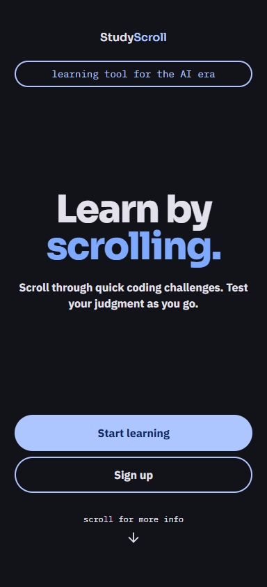
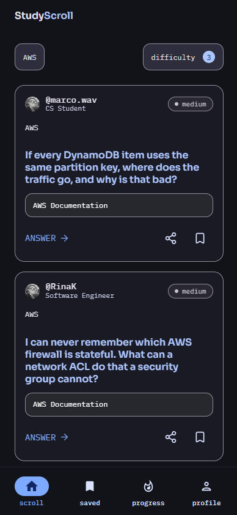
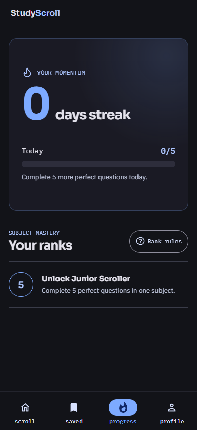

# StudyScroll

StudyScroll turns scrolling into active study. Learners move through a social-style feed of short technical challenges, judge three plausible replies as **Legit** or **Sus**, and get an explanation immediately.

The idea is simple: instead of asking people to build a new learning habit, make better use of one they already have.

**[Try the live app](https://study-scroll-silk.vercel.app)**

<p align="center">
  
  
  
</p>

## How it works

Each post presents one question and three replies written as a small social discussion. The learner judges every reply, then commits all three choices before seeing the result. A question counts as perfect only when all three judgments are correct.

Wrong answers return, perfect answers move through longer review intervals, and progress is tied to subjects rather than raw activity. Five perfect questions in one subject unlock Junior Scroller. Later ranks unlock at 15, 35, 65, and 120.

The MVP currently includes:

- 168 reviewed questions across 14 technical and mathematical topics
- Infinite scrolling with topic search and difficulty filters
- Immediate grading without exposing answer keys to the browser
- Saved posts, sharing, daily streaks, and subject ranks
- Guest mode with local progress
- Supabase accounts with synchronized progress and PostgreSQL persistence
- Email and Google login, password recovery, account settings, and account deletion
- A responsive desktop layout built around the mobile experience

The research behind the learning loop is documented in the [whitepaper](docs/WHITEPAPER.md).

## Mobile first

StudyScroll was designed for phones first. The feed, bottom navigation, filters, answer sheets, and touch targets all start from the mobile experience defined in the original [Figma design](https://www.figma.com/design/HGWDBinn0RIboxdUAf43su/Studyscroll).

On desktop, navigation moves to a fixed sidebar and the feed becomes wider and flatter. It is still the same product, not a separate desktop application.

## Accounts and access

The learning feed remains free:

- **Guest:** 10 posts per day, every topic, no registration
- **Free account:** 100 posts per day, synchronized progress, returning mistakes, streaks, and ranks
- **Premium concept:** everything above, plus AI-generated question sets from a short prompt

The premium AI workflow is a non-working proof of concept for the hackathon. Its server-only pipeline includes prompt validation, moderation, structured generation, factual review, and bounded repair, but it stays disabled until payments, entitlements, distributed rate limiting, and background jobs exist.

## Architecture

StudyScroll is a Next.js 16 application with React 19 and TypeScript. The browser talks only to Next.js route handlers. Those routes load questions from either the reviewed JSON dataset or PostgreSQL, grade answers on the server, and verify Supabase sessions before accessing learner data.

PostgreSQL is modeled with Prisma 7 and stores question sets, answers, attempts, review schedules, saves, streaks, ranks, and short-lived password recovery grants. The production app runs on Vercel with Supabase Postgres and Supabase Auth.

Key technical choices:

- Versioned and validated question datasets
- Mock and PostgreSQL modes behind the same API
- Idempotent database seed for all 168 curated questions
- Server-side grading and bounded request bodies
- Per-user progress queries scoped to a verified Supabase UUID
- Row Level Security with no public browser policies on application tables
- Infinite-feed pagination and a connection limit suited to serverless functions
- Accessible dialogs, keyboard controls, focus handling, and reduced-motion support

More detail is available in [DATABASE.md](docs/DATABASE.md), [AUTH.md](docs/AUTH.md), [SECURITY.md](docs/SECURITY.md), and the [AI activation guide](lib/ai-question-generation/ACTIVATION.md).

## Run locally

```bash
npm install
npm run dev:mock
```

Open [http://localhost:3000](http://localhost:3000).

Use `npm run dev:mock` for the local reviewed dataset or `npm run dev:postgres` to require PostgreSQL. Database migrations and seeding are covered in [DATABASE.md](docs/DATABASE.md).

## Validation

```bash
npm run check
```

The validation pipeline checks TypeScript, the complete dataset, Prisma, security controls, learning behavior, the AI scaffold, the production build, client-bundle leakage, and the guest flow on mobile and desktop Chromium.

## How we worked with Codex

StudyScroll did not come from one giant prompt. It grew through a tight loop: explain an idea, build it, use the running app, notice what felt wrong, and revise it.

Dragan brought the product idea, research, business rules, and a strong opinion about the experience. Nathalia created the visual direction in Figma. Codex, powered by GPT-5.6, helped turn rough notes into working code across the frontend, backend, database, authentication, tests, and deployment setup. Because Codex could inspect both the repository and the live interface, small observations such as an icon feeling off, a line sounding artificial, or a loading state flashing at the wrong time could become tested changes within minutes.

Codex accelerated the work that normally spreads across several specialists. It helped shape and validate the 168-question dataset, build the Prisma model and APIs, connect Supabase accounts, implement returning-question schedules, review security boundaries, and test the complete learning flow. GPT-5.6 was particularly useful when one decision touched product, design, and engineering at the same time.

The product decisions stayed human. Dragan chose what StudyScroll should reward, how ranks work, what remains free, and which iterations felt authentic. Nathalia's design set the visual standard. Codex made those choices faster to explore and cheaper to change.

## Status

The hackathon MVP is live on Vercel with its PostgreSQL feed and account system connected. The next stage is production email delivery, full Google OAuth verification, analytics, and the infrastructure required to activate premium AI question generation safely.

## Credits

Created by **Dragan Sanjevic** and **Nathalia Lenci**.
